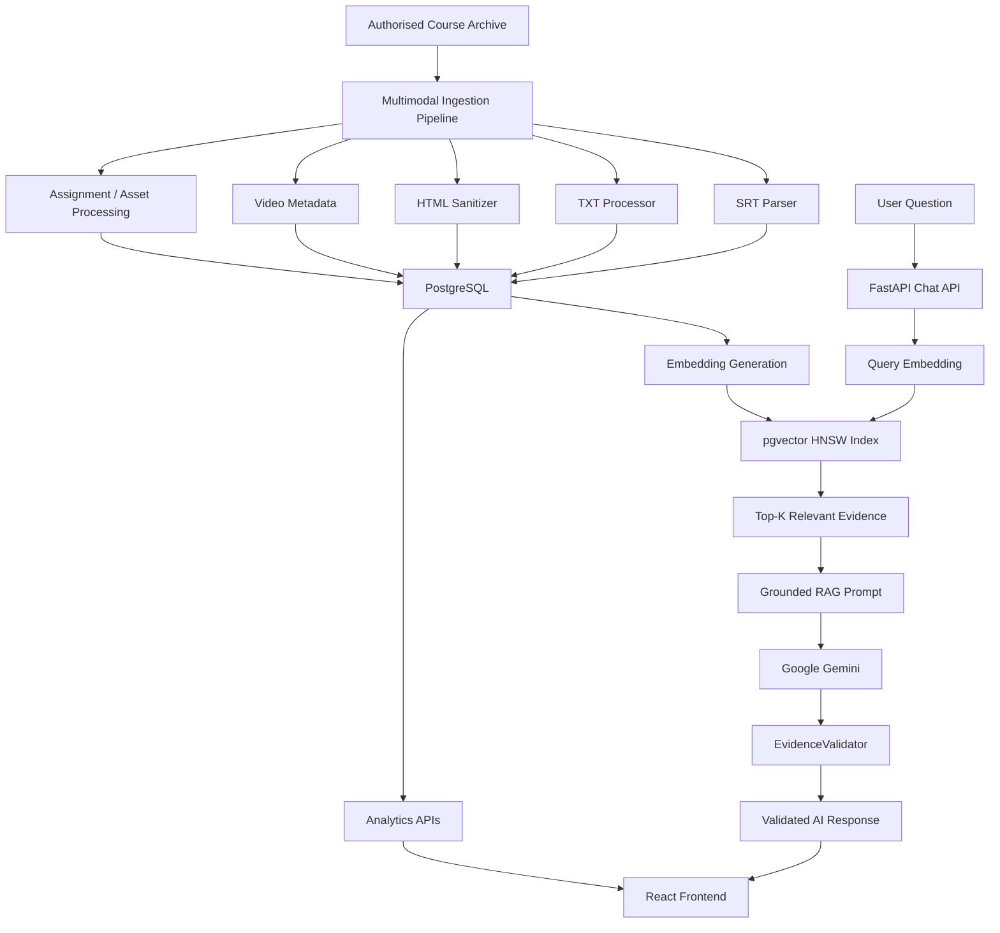

# 🎓 Coursera Multimodal Intelligence Platform

> **An evidence-grounded multimodal learning analytics and conversational AI platform that transforms authorised course archives into structured, searchable knowledge and course-specific AI insights.**

[](https://www.python.org/)
[](https://react.dev/)
[](https://fastapi.tiangolo.com/)
[](https://www.postgresql.org/)
[](https://github.com/pgvector/pgvector)
[](https://ai.google.dev/)

---

## 🚀 Live Project & Demo

### 🌐 Live Application

> **Live Project:**  
> https://coursera-multimodal-intelligence-pl.vercel.app/

### 🎥 Product Demo Video

> **Demo Video:**  
> https://drive.google.com/file/d/1zMS4HWYuXRFo3YML37sVrjkw8_y9CDAg/view?usp=sharing

The video demonstrates the complete workflow, including:

- Multimodal course knowledge processing
- Course analytics dashboard
- Detected learning issues
- Pedagogical recommendations
- Course review and verification
- Conversational AI assistant
- Evidence-grounded responses
- Citation/evidence display

---

# 📌 Project Overview

The **Coursera Multimodal Intelligence Platform** is a full-stack learning analytics and conversational AI platform designed to process authorised course archives containing multiple types of educational content.

The platform can work with:

- Video metadata
- SRT subtitles
- TXT transcripts
- HTML readings
- Assignments
- Course modules
- Lessons
- Learning assets

The ingestion pipeline converts these raw materials into a structured PostgreSQL knowledge base. Text content is transformed into dense vector embeddings and indexed using **pgvector** for semantic retrieval.

When a learner asks a question, the RAG pipeline:

```text
User Question
      ↓
Query Embedding
      ↓
Semantic Retrieval
      ↓
PostgreSQL + pgvector
      ↓
Relevant Course Evidence
      ↓
Grounded Prompt
      ↓
Google Gemini
      ↓
Evidence Validation
      ↓
Final Answer + Evidence
```

The goal is to provide a course-specific AI assistant that answers questions using relevant course material instead of relying only on generic LLM knowledge.

---

# 🎯 Problem Statement

Traditional online learning platforms contain large amounts of educational content distributed across different formats.

For example:

```text
Course
 ├── Videos
 ├── Transcripts
 ├── Readings
 ├── Assignments
 ├── Quizzes
 └── Curriculum Structure
```

Finding relevant information across these materials manually can be difficult.

A conventional chatbot also has a major limitation: it may generate an answer that sounds correct but is not actually supported by the course material.

This project addresses these problems by combining:

- Multimodal content ingestion
- Structured data processing
- Semantic search
- Vector databases
- Retrieval-Augmented Generation
- Evidence validation
- Learning analytics
- Conversational AI

---

# 💡 Solution

The platform creates a searchable representation of course knowledge.

### High-level workflow

```text
Authorised Course Archive
          ↓
Multimodal Ingestion
          ↓
Content Cleaning & Validation
          ↓
PostgreSQL Knowledge Base
          ↓
Text Chunking
          ↓
384-Dimensional Embeddings
          ↓
pgvector Semantic Search
          ↓
Relevant Evidence
          ↓
Gemini 2.5 Flash
          ↓
Evidence Validation
          ↓
Grounded AI Response
```

The platform also provides an analytics dashboard for inspecting course-related issues and recommendations.

---

# 🏗️ System Architecture



---

# 🔄 End-to-End RAG Workflow

The conversational AI follows the following process:

### 1. User submits a question

Example:

> "What is the difference between Big Data and Data Mining?"

### 2. Query embedding

The question is converted into a numerical vector using:

```text
sentence-transformers/all-MiniLM-L6-v2
```

The model generates a **384-dimensional embedding**.

### 3. Semantic retrieval

The embedding is compared with stored transcript and reading embeddings using PostgreSQL + pgvector.

The system retrieves the most relevant evidence.

### 4. Relevance filtering

The RAG pipeline applies a similarity threshold before generating a grounded response.

The configured threshold is:

```text
0.40
```

### 5. Prompt construction

The retrieved evidence is inserted into a structured RAG prompt.

The model is instructed to:

- Use retrieved evidence
- Avoid unsupported information
- Identify supporting evidence IDs
- Indicate when evidence is insufficient

### 6. Gemini generation

The grounded prompt is sent to:

```text
Google Gemini 2.5 Flash
```

### 7. Evidence validation

The generated response is checked by:

```text
EvidenceValidator
```

The validator ensures that the evidence IDs returned by the model exist in the retrieved evidence.

### 8. Final response

The frontend displays:

- AI-generated answer
- Confidence
- Supporting evidence
- Evidence/citation information

---

# 🤖 AI & RAG Architecture

## Embedding Model

The platform uses:

```text
sentence-transformers/all-MiniLM-L6-v2
```

### Why?

It provides:

- Lightweight semantic embeddings
- Fast inference
- 384-dimensional vectors
- Good suitability for semantic retrieval

---

## Vector Database

The platform uses:

```text
PostgreSQL 16 + pgvector
```

The embeddings are stored directly inside PostgreSQL.

Semantic retrieval uses cosine distance through pgvector.

Conceptually:

```text
Similarity = 1 - CosineDistance(Query, Document)
```

The highest-scoring relevant chunks are returned to the RAG pipeline.

---

# 🛡️ Evidence Validation

A major feature of the AI layer is the **EvidenceValidator**.

The generated response contains evidence IDs such as:

```text
E1
E2
E3
```

The validator compares these IDs with the IDs of the evidence retrieved from the database.

Conceptually:

```text
Retrieved Evidence
        ↓
[E1, E2, E3, E4, E5]
        ↓
        Gemini
        ↓
Generated IDs
[E1, E3]
        ↓
EvidenceValidator
        ↓
Valid → Return response
Invalid → Reject / handle response
```

This adds an additional validation layer to the RAG workflow.

---

# 📚 Validation Dataset

The platform was validated using the:

## IBM Data Science Professional Certificate

The local authorised course archive contains multiple educational assets.

The documented benchmark includes:

| Metric | Value |
|---|---:|
| Source files | 157 |
| Video files | 45 |
| SRT transcripts | 45 |
| TXT transcripts | 45 |
| HTML readings | 22 |
| Course modules | 4 |
| Lesson groups | 12 |
| Lesson records | 65 |
| RAG-eligible assets | 154 |
| Vector embeddings | 9,479 |
| Embedding dimension | 384 |

The raw archive is treated as the source of truth and the preprocessing pipeline creates structured representations without modifying the original source archive.

---

# 🧹 Multimodal Data Processing

## SRT Processing

Location:

```text
preprocessing/transcript/process_srt.py
```

The SRT processor:

1. Reads subtitle files
2. Parses subtitle blocks
3. Extracts timestamps
4. Cleans subtitle text
5. Validates subtitle structure
6. Stores transcript segments
7. Preserves timing information

Example:

```text
00:02:10,100 --> 00:02:15,300
Data science combines statistics,
programming and domain knowledge.
```

is converted into a structured transcript segment.

---

# 📝 TXT Processing

Location:

```text
preprocessing/transcript/process_txt.py
```

The TXT processor:

- Normalises text
- Splits content into sentences
- Creates semantic chunks
- Uses approximately 500-token target chunks
- Adds overlap between chunks
- Attempts timestamp alignment with SRT transcripts
- Stores processed chunks in PostgreSQL

This creates retrieval-friendly text units.

---

# 🌐 HTML Processing

Location:

```text
preprocessing/html_proc/process_html.py
```

The HTML processor:

- Parses HTML using BeautifulSoup
- Removes unnecessary HTML structure
- Extracts useful reading content
- Handles embedded base64 images
- Classifies reading types
- Determines whether content should be included in RAG

Administrative content can be excluded from the RAG corpus.

---

# 🗄️ Database Architecture

The PostgreSQL database maintains the course hierarchy and processed learning assets.

Conceptual structure:

```text
courses
   │
   ├── course_modules
   │       │
   │       └── lesson_groups
   │              │
   │              └── lessons
   │                     │
   │                     └── assets
   │                            ├── videos
   │                            ├── transcripts
   │                            ├── transcript_segments
   │                            └── readings
   │
   ├── processing_jobs
   │
   └── data_quality_issues
```

The repository documents a **12-table relational structure** for maintaining course hierarchy, assets, transcripts, readings, processing information and data-quality information.

---

# 🔗 Asset Traceability

The platform maintains a source lineage from course content to retrieved evidence.

```text
Course
  ↓
Module
  ↓
Lesson
  ↓
Asset
  ↓
Source File
  ↓
Transcript / Reading
  ↓
Segment
  ↓
Embedding
  ↓
AI Evidence
```

This allows retrieved AI evidence to be associated with its original course content.

---

# 📊 Learning Analytics Dashboard

The frontend provides an instructional analytics dashboard.

The dashboard includes areas such as:

### 📈 Course Overview

- Courses analysed
- Detected issues
- Recommendations
- Pending reviews

### ⚠️ Detected Issues

Issues can be categorised into areas such as:

- Concept confusion
- Pacing/replay issues
- Quiz/lab problems
- Insufficient examples

### 💡 Pedagogical Recommendations

The platform provides recommendations such as:

- Interactive checkpoints
- Explanatory analogies
- Code examples
- Benchmark-based explanations

### 🕒 Course Reviews

The platform provides a review workflow for checking:

- Transcript synchronisation
- Reading sanitisation
- Vector embeddings
- Instructor verification

---

# 🤖 Conversational AI Assistant

The platform provides a course-specific conversational interface.

Example interaction:

```text
User:
Explain Big Data and Data Mining.

Assistant:
[Grounded explanation]

Evidence:
[E1] Transcript segment
[E2] Reading segment
```

The interface supports:

- Markdown responses
- Evidence display
- Course-specific questions
- Suggested prompts
- AI-assisted learning explanations

---

# 🖥️ Frontend

The frontend is implemented using:

- React 19
- Vite
- Tailwind CSS
- Axios
- React Markdown
- Material UI icons

The frontend communicates with the FastAPI backend through REST APIs.

---

# ⚙️ Backend

The backend uses:

- Python
- FastAPI
- SQLAlchemy
- Pydantic
- Uvicorn

The backend is organised into API routers:

```text
coursera_insight_backend/
│
├── main.py
├── config.py
├── database.py
├── models.py
├── schemas.py
│
└── routers/
    ├── courses.py
    ├── analysis.py
    └── chat.py
```

### Main API areas

```text
/courses
/analysis
/chat
```

FastAPI also provides interactive API documentation through:

```text
/docs
```

---

# 🧰 Technology Stack

| Layer | Technology | Why It Is Used |
|---|---|---|
| Frontend | React 19 | Build interactive SPA |
| Frontend tooling | Vite | Fast development and production builds |
| Styling | Tailwind CSS | Rapid responsive UI development |
| Backend | FastAPI | Lightweight Python REST API |
| ORM | SQLAlchemy | Database interaction |
| Validation | Pydantic | Request/response validation |
| Database | PostgreSQL 16 | Relational course data |
| Vector Search | pgvector | Semantic similarity search |
| Embeddings | all-MiniLM-L6-v2 | Generate compact semantic vectors |
| LLM | Gemini 2.5 Flash | Generate grounded natural-language responses |
| HTML Processing | BeautifulSoup4 | Extract clean reading content |
| Video Metadata | FFmpeg / ffprobe | Extract video metadata |
| Testing | pytest | Automated backend testing |
| Containerisation | Docker | Reproducible deployment |
| Frontend Deployment | Vercel | Host React application |
| Backend Deployment | Render | Host FastAPI service |
| Cloud Database | Supabase | PostgreSQL + pgvector hosting |
| Version Control | Git/GitHub | Source control and collaboration |

---

# 📁 Repository Structure

```text
Coursera-Multimodal-Intelligence-Platform/
│
├── AI_RAG/
│   ├── pipeline.py
│   │
│   ├── embedding/
│   │   ├── embedder.py
│   │   ├── data_loader.py
│   │   └── store_embeddings.py
│   │
│   ├── retrieval/
│   │   └── retriever.py
│   │
│   └── llm/
│       ├── model.py
│       ├── prompts.py
│       ├── synthesizer.py
│       └── evidence_validator.py
│
├── coursera_insight_backend/
│   ├── main.py
│   ├── config.py
│   ├── database.py
│   ├── models.py
│   ├── schemas.py
│   │
│   └── routers/
│       ├── courses.py
│       ├── analysis.py
│       └── chat.py
│
├── preprocessing/
│   ├── run_pipeline.py
│   ├── extract_course.py
│   ├── load_to_db.py
│   │
│   ├── transcript/
│   │   ├── process_srt.py
│   │   └── process_txt.py
│   │
│   ├── html_proc/
│   │   └── process_html.py
│   │
│   ├── video/
│   ├── assignment/
│   └── quality/
│
├── database/
│   ├── init_db.py
│   ├── validate_phase3.py
│   ├── generate_sample_rag.py
│   └── migrations/
│
├── frontend/
│   ├── package.json
│   ├── vite.config.js
│   ├── vercel.json
│   └── src/
│       ├── main.jsx
│       └── App.jsx
│
├── tests/
│   ├── test_srt_parser.py
│   ├── test_txt_chunker.py
│   ├── test_html_extractor.py
│   └── test_utils.py
│
├── Ai_Tests/
│   ├── test_evidence_validator.py
│   ├── test_invalid_evidence.py
│   ├── test_relevance_guardrail.py
│   └── test_threshold.py
│
├── docs/
│   ├── images/
│   ├── course_structure.md
│   ├── asset_relationships.md
│   ├── database_design.md
│   ├── data_quality_report.md
│   ├── ai_rag_data_contract.md
│   └── sample_rag_records.json
│
├── Dockerfile.backend
├── docker-compose.yml
├── render.yaml
├── requirements.txt
├── DEPLOYMENT.md
└── README.md
```

---

# 🔄 Preprocessing Pipeline

The master preprocessing pipeline is located at:

```text
preprocessing/run_pipeline.py
```

The documented processing sequence is:

```text
1. Extract Course Archive
        ↓
2. Load Course Hierarchy
        ↓
3. Process SRT Transcripts
        ↓
4. Process TXT Transcripts
        ↓
5. Process HTML Readings
        ↓
6. Process Video Metadata
        ↓
7. Run Data Quality Checks
```

Each step is tracked and timed.

The pipeline is designed to continue processing later stages even when an individual stage encounters an error, while recording the failure for reporting.

---

# 🧪 Testing & Quality Assurance

The repository contains multiple testing layers.

## Unit / Parser Tests

The test suite covers:

- SRT parsing
- TXT chunking
- HTML extraction
- Utility functions
- Metadata handling
- Data processing behaviour

Run:

```bash
pytest -q
```

---

## AI Guardrail Tests

The AI-specific tests cover:

- Evidence validation
- Invalid evidence IDs
- Relevance threshold
- Retrieval threshold behaviour

Examples:

```bash
pytest Ai_Tests/test_evidence_validator.py -q
```

```bash
python Ai_Tests/test_invalid_evidence.py
```

---

## Frontend Build Validation

The React production build can be validated with:

```bash
cd frontend
npm run build
```

---

# 🔐 Security & Data Handling

The project follows several security practices:

### Environment Variables

Sensitive configuration such as:

```text
GEMINI_API_KEY
DATABASE_URL
DB_PASSWORD
```

is intended to be provided through environment variables rather than committed directly to source control.

### `.gitignore`

Sensitive local configuration and generated files are excluded from version control.

### Authorised Data

The platform is designed to process **authorised course archives** rather than performing unauthorised course scraping.

### Source Preservation

The raw archive is treated as an immutable source of truth during preprocessing.

---

# ☁️ Deployment Architecture

The documented cloud deployment architecture is:

```text
                    Internet
                       │
                       ▼
              ┌─────────────────┐
              │     Vercel      │
              │ React Frontend  │
              └────────┬────────┘
                       │
                       ▼
              ┌─────────────────┐
              │     Render      │
              │ FastAPI Backend │
              └────────┬────────┘
                       │
                       ▼
              ┌─────────────────┐
              │    Supabase     │
              │ PostgreSQL +    │
              │    pgvector     │
              └─────────────────┘
                       │
                       ▼
              ┌─────────────────┐
              │ Google Gemini   │
              │ 2.5 Flash       │
              └─────────────────┘
```

---

# 🚀 Local Setup

## Prerequisites

Install:

- Python 3.11+
- Node.js 18+
- PostgreSQL 16
- pgvector
- Git
- FFmpeg / ffprobe
- Google Gemini API key

---

## 1. Clone Repository

```bash
git clone https://github.com/Chetanpatil71502/Coursera-Multimodal-Intelligence-Platform.git

cd Coursera-Multimodal-Intelligence-Platform
```

---

## 2. Create Python Environment

### Windows

```bash
python -m venv .venv

.venv\Scripts\activate
```

### Linux / macOS

```bash
python -m venv .venv

source .venv/bin/activate
```

---

## 3. Install Python Dependencies

```bash
pip install -r requirements.txt
```

---

## 4. Configure Environment Variables

Create a `.env` file based on:

```text
.env.example
```

Example:

```env
DB_HOST=localhost
DB_PORT=5432
DB_NAME=coursera_platform
DB_USER=postgres
DB_PASSWORD=your_password

GEMINI_API_KEY=your_gemini_api_key
GEMINI_MODEL=gemini-2.5-flash
```

---

# 🗄️ Database Setup

Initialise the database:

```bash
python database/init_db.py
```

Make sure PostgreSQL has the pgvector extension enabled.

Example:

```sql
CREATE EXTENSION IF NOT EXISTS vector;
```

---

# 📦 Run Preprocessing

To process the course archive:

```bash
python preprocessing/run_pipeline.py
```

For environments where video processing is unavailable:

```bash
python preprocessing/run_pipeline.py --skip-video
```

---

# ⚡ Start Backend

Run:

```bash
uvicorn main:app --host 127.0.0.1 --port 8000 --reload
```

Backend health endpoint:

```text
http://127.0.0.1:8000/health
```

Swagger API documentation:

```text
http://127.0.0.1:8000/docs
```

---

# 💻 Start Frontend

Open another terminal:

```bash
cd frontend
```

Install dependencies:

```bash
npm install
```

Start development server:

```bash
npm run dev
```

The frontend will normally be available at:

```text
http://localhost:5173
```

---

# 🐳 Docker Setup

The repository also contains Docker configuration.

Start the stack with:

```bash
docker-compose up --build
```

The Docker setup is intended to orchestrate:

```text
PostgreSQL + pgvector
        +
FastAPI Backend
        +
React Frontend
```

---

# 📈 Key Project Results

The documented validation dataset and implementation currently include:

| Area | Result |
|---|---:|
| Source files processed | 157 |
| SRT files | 45 |
| TXT transcripts | 45 |
| HTML readings | 22 |
| Course modules | 4 |
| Lesson groups | 12 |
| Lesson records | 65 |
| RAG-eligible assets | 154 |
| Vector embeddings | 9,479 |
| Embedding size | 384 dimensions |
| Vector index | pgvector HNSW |
| RAG retrieval | Top-K semantic retrieval |
| Retrieval threshold | 0.40 |
| LLM | Gemini 2.5 Flash |

---

# 🎥 Demo Flow

The recommended product demonstration follows this sequence:

```text
1. Open Live Application
        ↓
2. Show Dashboard
        ↓
3. Show Course Information
        ↓
4. Show Detected Issues
        ↓
5. Show Recommendations
        ↓
6. Show Course Review
        ↓
7. Open AI Assistant
        ↓
8. Ask Course-Specific Question
        ↓
9. Show Generated Answer
        ↓
10. Show Supporting Evidence
        ↓
11. Ask Another Question
        ↓
12. Demonstrate Out-of-Scope / Insufficient Evidence Handling
        ↓
13. Briefly Show Architecture / Code
```

The most important part of the demonstration is the **end-to-end AI workflow**:

```text
Question
   ↓
Embedding
   ↓
Vector Retrieval
   ↓
Course Evidence
   ↓
Gemini
   ↓
Evidence Validation
   ↓
Grounded Answer
```

---

# 👥 Team Contributions

| Area | Contributors |
|---|---|
| Database & Preprocessing | Chetan Kailas Patil, Sona Christina A T |
| Backend / API | Tushar, Gaurav Jagannath Kadam |
| AI / RAG | Sakshi Kumari, Megha Mahesh Kanavi |
| Frontend | P Sankarshan |
| Testing / Integration / Deployment | Abhishek Kumar |

## My Contribution

My primary responsibility was the **Database & Preprocessing layer**.

Key contributions included:

- PostgreSQL database schema
- Course hierarchy and asset structure
- SRT subtitle processing
- TXT transcript processing
- Semantic text chunking
- HTML reading sanitisation
- Asset tracking
- SHA-256 based asset identification
- Data-quality validation
- Preparation of structured data for the RAG pipeline

---

# 📚 Documentation

Additional technical documentation is available in the repository:

| Document | Purpose |
|---|---|
| `DEPLOYMENT.md` | Deployment instructions |
| `docs/database_design.md` | Database architecture |
| `docs/course_structure.md` | Course hierarchy |
| `docs/asset_relationships.md` | Asset relationships |
| `docs/data_quality_report.md` | Data-quality validation |
| `docs/ai_rag_data_contract.md` | RAG data contract |
| `AI_RAG/HANDOFF.md` | AI/RAG architecture documentation |
| `integration_and_deployment_report.md` | Integration and deployment report |

---

# 🧠 Key Technical Concepts Demonstrated

This project demonstrates practical implementation of:

- Multimodal data ingestion
- Data preprocessing
- Text cleaning
- Semantic chunking
- Sentence embeddings
- Vector databases
- PostgreSQL
- pgvector
- HNSW indexing
- Cosine similarity
- Retrieval-Augmented Generation
- Prompt engineering
- LLM integration
- Evidence validation
- Anti-hallucination techniques
- REST APIs
- FastAPI
- React
- Cloud deployment
- Automated testing
- Docker
- Git/GitHub

---

# 🔮 Future Improvements

Potential future improvements include:

- More advanced multimodal embeddings
- Direct image and slide understanding
- Better learner-level personalisation
- Real learner interaction telemetry
- Automated quiz-performance integration
- More sophisticated recommendation models
- Streaming RAG responses
- Improved authentication and role-based access
- More comprehensive evaluation benchmarks
- Automated evaluation of answer faithfulness and relevance

---

# 📜 License

This project is currently maintained as a project repository for educational, demonstration, and evaluation purposes.

---

# ⭐ Acknowledgements

This project was developed as a collaborative engineering project combining:

**Data Engineering + Backend Engineering + AI/RAG + Frontend Engineering + Testing + Cloud Deployment**

The IBM Data Science Professional Certificate archive was used as the validation dataset for testing the multimodal ingestion and retrieval workflow.

---

# 🔗 Project Links

### 🌐 Live Application

https://coursera-multimodal-intelligence-pl.vercel.app/

### 🎥 Demo Video

https://drive.google.com/file/d/1zMS4HWYuXRFo3YML37sVrjkw8_y9CDAg/view?usp=sharing

### 💻 GitHub Repository

https://github.com/Chetanpatil71502/Coursera-Multimodal-Intelligence-Platform
